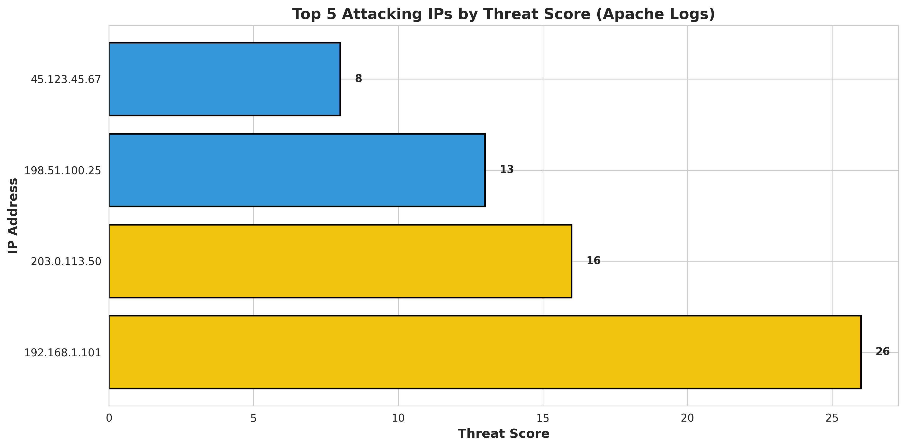
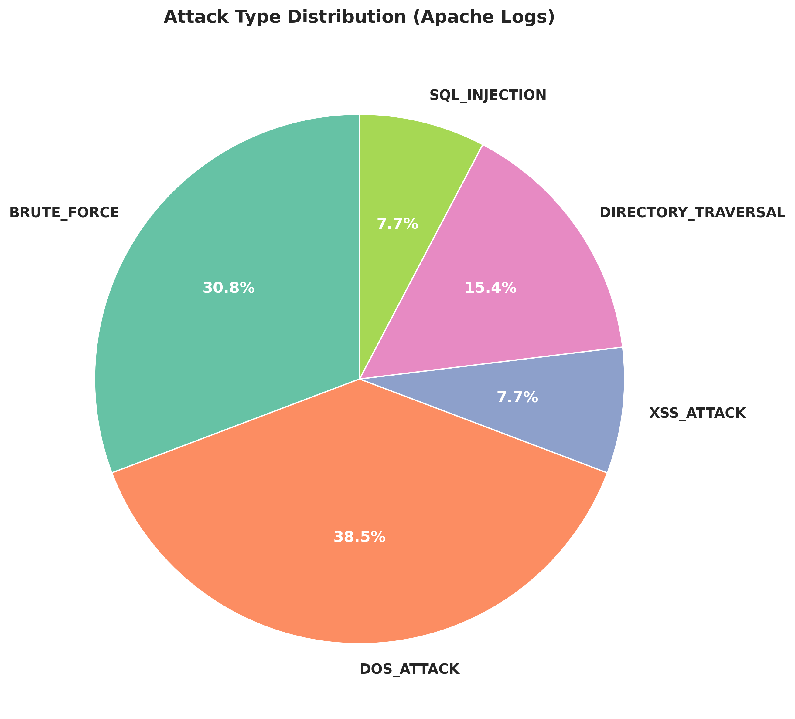
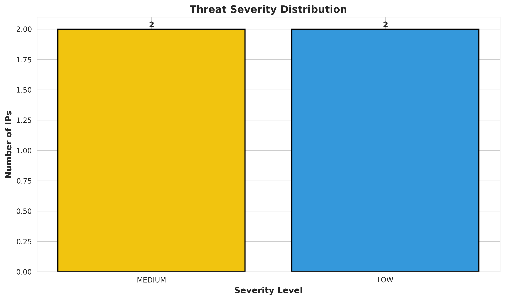

# 🔒 Log File Analyzer for Intrusion Detection

[](https://www.python.org/)
[](LICENSE)
[]()

A powerful Python-based security tool that detects and analyzes suspicious patterns in Apache web server and SSH authentication logs. Built with advanced detection algorithms including sliding window brute-force detection, DoS attack identification, and injection attack pattern matching.

## ✨ Features

- **🔍 Multi-Log Support**: Parse Apache access logs and SSH authentication logs
- **🧠 Advanced Detection**:
  - Sliding window brute-force detection
  - DoS/DDoS rate-limiting analysis
  - SQL injection, XSS, and directory traversal detection
- **📊 IP Reputation Scoring**: Multi-factor threat assessment system
- **📈 Professional Visualizations**: Auto-generated charts (matplotlib/seaborn)
- **💾 Multiple Export Formats**: CSV and JSON for SIEM integration
- **⚙️ Command-Line Interface**: Comprehensive CLI with argparse
- **🔧 Modular Architecture**: Easily extensible for new log types and detectors

## 🚀 Quick Start

### Installation

```bash
# Clone the repository
git clone https://github.com/yourusername/log-analyzer.git
cd log-analyzer

# Install dependencies
pip install -r requirements.txt
```

### Basic Usage

```bash
# Analyze Apache logs
python main.py -f access.log -t apache

# Analyze SSH logs
python main.py -f auth.log -t ssh

# Generate visualizations
python main.py -f access.log -t apache --visualize

# Custom thresholds
python main.py -f auth.log -t ssh --bf-threshold 3 --dos-threshold 20
```

## 📊 Example Output

### Apache Log Analysis
```
================================================================================
APACHE LOG ANALYSIS RESULTS
================================================================================

Total Threat Events: 9
Unique Attacking IPs: 4

Severity Breakdown:
  CRITICAL: 0
  HIGH:     0
  MEDIUM:   2

Top 5 Attacking IPs:
  1. 192.168.1.101
     Score: 26 (MEDIUM)
     Attacks: 4
     Types: DOS_ATTACK, BRUTE_FORCE

  2. 203.0.113.50
     Score: 16 (MEDIUM)
     Attacks: 2
     Types: XSS_ATTACK, SQL_INJECTION
```

### Generated Visualizations





## 🏗️ Project Structure

```
log_analyzer/
├── main.py                    # Entry point with CLI
├── config.yaml               # Configuration file
├── requirements.txt          # Dependencies
├── parsers/
│   ├── base_parser.py       # Abstract parser class
│   ├── apache_parser.py     # Apache log parser
│   └── ssh_parser.py        # SSH log parser
├── detectors/
│   ├── brute_force.py       # Brute-force detection
│   ├── dos_detector.py      # DoS detection
│   └── injection_detector.py # SQL/XSS detection
├── intelligence/
│   ├── ip_reputation.py     # Threat scoring
│   └── geoip_lookup.py      # Geographic lookup
├── visualization/
│   └── charts.py            # Chart generation
├── export/
│   ├── csv_exporter.py      # CSV export
│   └── json_exporter.py     # JSON export
└── utils/
    └── helpers.py           # Utility functions
```

## 🔧 Detection Algorithms

### Sliding Window Brute-Force Detection
Tracks failed authentication attempts over time using an efficient sliding window algorithm. Automatically removes outdated attempts and triggers alerts when thresholds are exceeded.

**Default Settings:**
- Time window: 5 minutes
- Threshold: 5 failed attempts

### DoS Attack Detection
Monitors request rates per IP address to identify potential denial-of-service attacks.

**Default Settings:**
- Time window: 60 seconds
- Threshold: 10 requests

### Injection Attack Detection
Pattern-based detection using pre-compiled regex for:
- **SQL Injection**: `union select`, `or 1=1`, `drop table`, etc.
- **XSS Attacks**: `<script>`, `javascript:`, `alert()`, etc.
- **Directory Traversal**: `../`, `/etc/passwd`, `%2e%2e/`, etc.

## 📈 IP Reputation Scoring

### Scoring Formula
```
threat_score = (blacklist_hits × 10) + 
               (failed_attempts × 5) + 
               (attack_types × 3) + 
               (requests_per_minute ÷ 10 × 2)
```

### Severity Levels
| Score | Severity | Priority |
|-------|----------|----------|
| 50+ | CRITICAL | Immediate |
| 30-49 | HIGH | Urgent |
| 15-29 | MEDIUM | Priority |
| 5-14 | LOW | Monitor |
| 0-4 | INFO | Log only |

## 📋 CLI Arguments

| Argument | Type | Description |
|----------|------|-------------|
| `-f, --file` | Required | Path to log file |
| `-t, --type` | Required | Log type (`apache` or `ssh`) |
| `--bf-threshold` | Optional | Brute-force threshold (default: 5) |
| `--dos-threshold` | Optional | DoS requests threshold (default: 10) |
| `-o, --output` | Optional | Output directory (default: `output`) |
| `--format` | Optional | Export format (`csv`, `json`, `both`) |
| `--visualize` | Flag | Generate visualization charts |
| `-v, --verbose` | Flag | Enable verbose logging |

## 📦 Dependencies

```
pandas>=1.3.0
numpy>=1.21.0
matplotlib>=3.4.0
seaborn>=0.11.0
```

## 🔮 Future Enhancements

- [ ] Real-time log monitoring (tail -f functionality)
- [ ] API integration (AbuseIPDB, GeoIP)
- [ ] Machine learning anomaly detection
- [ ] Web-based dashboard
- [ ] Multi-server log aggregation
- [ ] SIEM integration (Splunk, ELK)
- [ ] Automated response actions
- [ ] Email/Slack notifications

## 🧪 Testing

Sample log files are included in the `tests/sample_logs/` directory:
- `apache_access.log`: Apache web server access log
- `ssh_auth.log`: SSH authentication log

Run tests:
```bash
python main.py -f tests/sample_logs/apache_access.log -t apache --visualize
python main.py -f tests/sample_logs/ssh_auth.log -t ssh --visualize
```

## 🤝 Contributing

Contributions are welcome! Here's how you can help:

1. Fork the repository
2. Create a feature branch (`git checkout -b feature/amazing-feature`)
3. Commit your changes (`git commit -m 'Add amazing feature'`)
4. Push to the branch (`git push origin feature/amazing-feature`)
5. Open a Pull Request

### Areas for Contribution
- Additional log format parsers (Nginx, IIS, etc.)
- New detection algorithms
- Performance optimizations
- Documentation improvements
- Bug fixes

## 🙏 Acknowledgments

- Built with Python's powerful libraries: pandas, matplotlib, seaborn
- Inspired by security tools like OSSEC and Fail2ban
- Thanks to the open-source community

## 📧 Contact

**Author:** Mohan Kumar  
**Institution:** Amrita University  
**Project:** Cybersecurity Research & Development

For issues, questions, or suggestions, please open an issue on GitHub.

---

**Made with ❤️ for cybersecurity professionals and enthusiasts**
